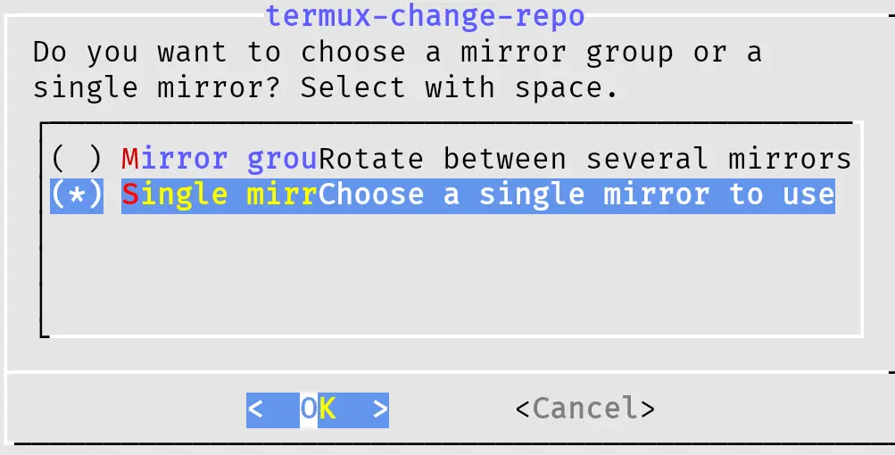
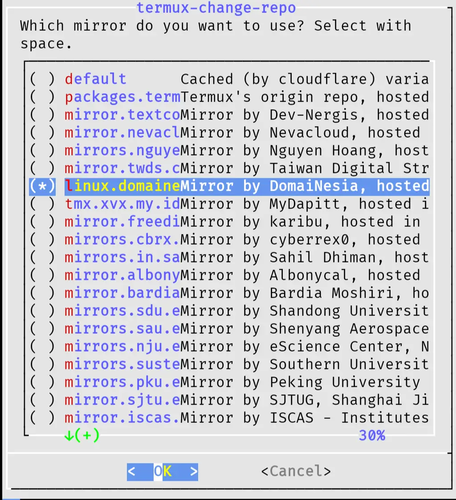

Secara singkat, termux adalah aplikasi emulator terminal yang memungkinkan kamu menjalankan lingkungan kerja layaknya di terminal Linux.

Bagi kamu yang masih awam, dan mungkin saat ini bingung dengan apa yang harus dilakukan saat pertama kali menginstal termux, mari ikuti beberapa langkah berikut.

## Perbarui Package

Pertama kita awali dulu dengan melakukan pembaruan pada package atau paket bawaan yang sudah ada di termux, ini di maksudkan agar package yang ada di termux selalu dalam keadaan _up-to-date_. Untuk melakukannya ketikan perintah berikut ini lalu enter.

```shell
pkg update && pkg upgrade -y
```

---

## Izinkan Akses Penyimpanan

Agar termux bekerja secara optimal, maka kita perlu memberikannya izin untuk mengakses ke penyimpanan hp kita. Untuk memberikan akses ketik saja perintah berikut.

```shell
termux-setup-storage
```

Setelah itu akan muncul pop-up yang menanyakan, apakah kamu mengizinkan termux mengakses penyimpanan, disini pilih saja izinkan.

---

## Mengubah Mirror Repository

Seperti layaknya linux, di termux juga memiliki yang namanya mirror repository. Apa sih mirror repository itu? Mirror repository adalah semacam lokasi server hosting tempat di simpannya kumpulan package/pkg yang tersedia di termux.

Ibaratnya tujuan dari mengubah mirror repository itu seperti misalnya, saat ini saya berada di Kalimantan dan ingin membeli barang di toko online, produk yang ingin saya beli ada yang berlokasi di pulau Jawa dan ada juga yang di pulau Kalimantan, jika saya ingin produk yang lebih cepat sampai, maka pilihan saya tentunya produk yang lokasinya lebih dekat dengan lokasi saya, yaitu produk yang berasal dari kalimantan.

Nah jadi intinya, dengan mengubah lokasi mirror kita bisa membuat proses pengambilan atau mendownload paket menjadi lebih cepat. 

### Cara Merubah Lokasi

- Gunakan perintah berikut

```shell
termux-change-repo
```


- Pilih **Single Mirror**

  - **Panah** untuk berpindah menu
  - **Spasi** dan **Enter** untuk memilih
  - atau bisa juga gunakan touch screen untuk memilih

- Pilih Hosting terdekat



Kamu bisa memilih lokasi hosting terdekat dengan lokasi kamu saat ini, disini saya memilih **DomaiNesia** karena dihosting di Indonesia.

---

## Penutup

Itu tadi sedikit hal yang bisa kamu lakukan saat baru pertama kali menginstall termux, tutorial ini dibuat untuk kamu yang masih awam sekali dengan aplikasi termux.